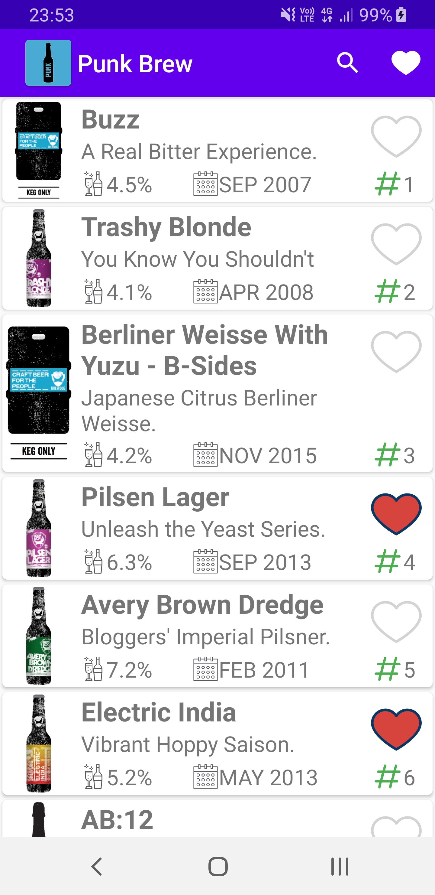
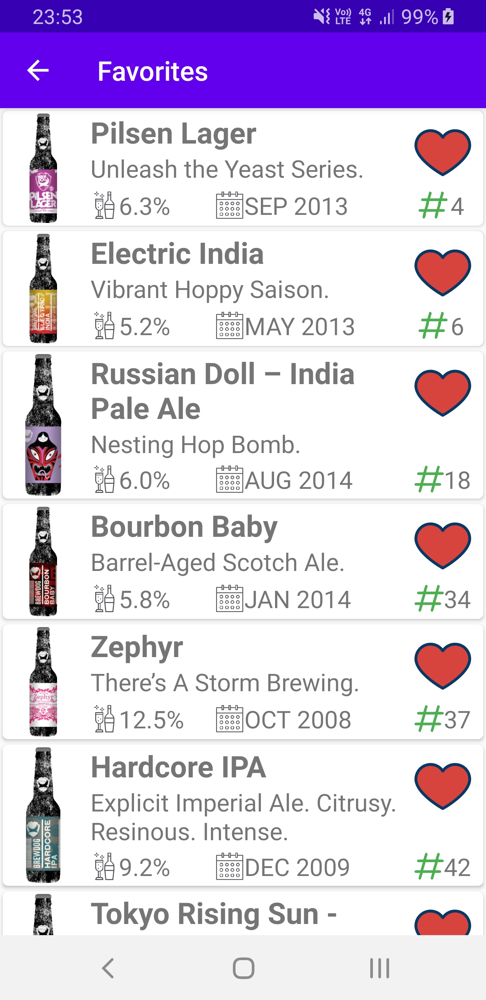
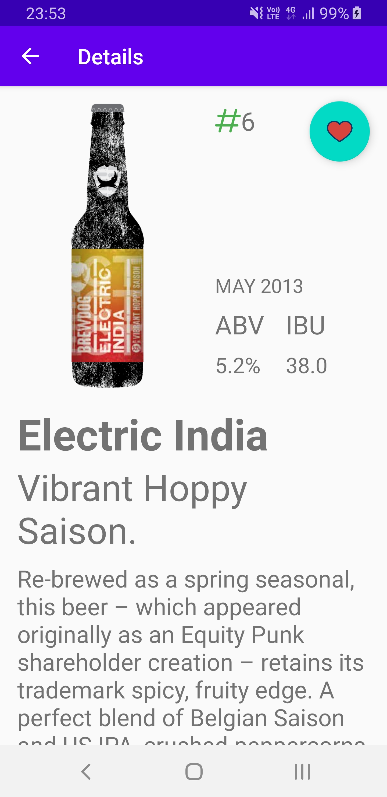

# Punk Brew


The project is [Kotlin](https://github.com/JetBrains/kotlin) based Android application, which represents [BrewDog](https://www.brewdog.com) beer catalogue fetch data from [Punk API](https://punkapi.com) and store the data locally. In this application you can view the entire catalog of BrewDog kinds of beer, detailed information about each kind of beer as well as add it to favorites.

Application follows MVVM pattern and use LiveData and ViewModel from [Android Architecture Components](https://github.com/android/architecture-components-samples).

## Usage

List of beers                       | Favorites                          | Beer details                          
:----------------------------------:|:----------------------------------:|:--------------------------------------:
 |     |        

## Dependencies

* [Kotlin](https://github.com/JetBrains/kotlin) 1.4.10
* [Koin](https://github.com/InsertKoinIO/koin) 2.0.1
* [Retrofit](https://github.com/square/retrofit) 2.9.0
* [OkHttp](https://github.com/square/okhttp) 4.7.2
* [RxJava](https://github.com/ReactiveX/RxJava) 2.2.19
* [Picasso](https://github.com/square/picasso) 2.71828
* [Room](https://developer.android.com/topic/libraries/architecture/room) 2.2.5
* [Timber](https://github.com/JakeWharton/timber) 4.7.1

## Building

Run [Gradle](https://github.com/gradle/gradle) from the root directory of the project to build it.

``` bash
./gradlew build
```

After completion there will be two directories in app/build/outputs/apk with apk files for debug and release.

In order to run unit tests:

```bash
./gradlew clean test
```

In order to run android instrumentation tests (please make sure you have
device connected or emulator running):

```bash
./gradlew connectedAndroidTest
```

If you want to install app to your device/emulator, run:
```bash
./gradlew installDebug
```

## License

[MIT](LICENSE) © [alxiw](https://github.com/alxiw)
