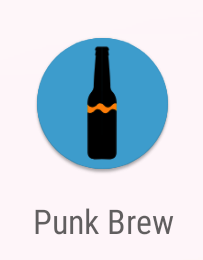
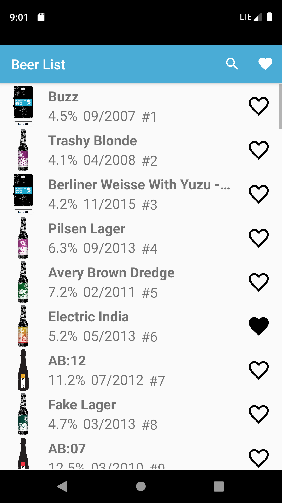
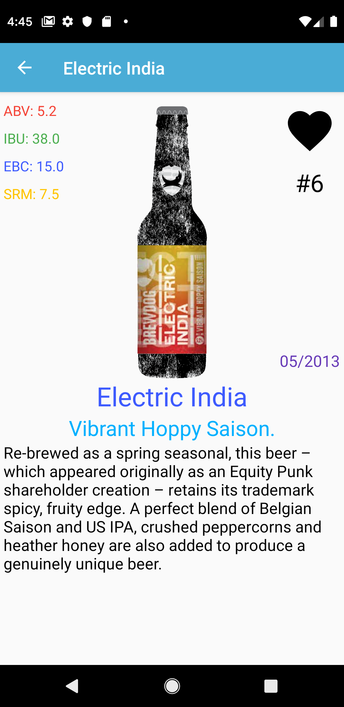
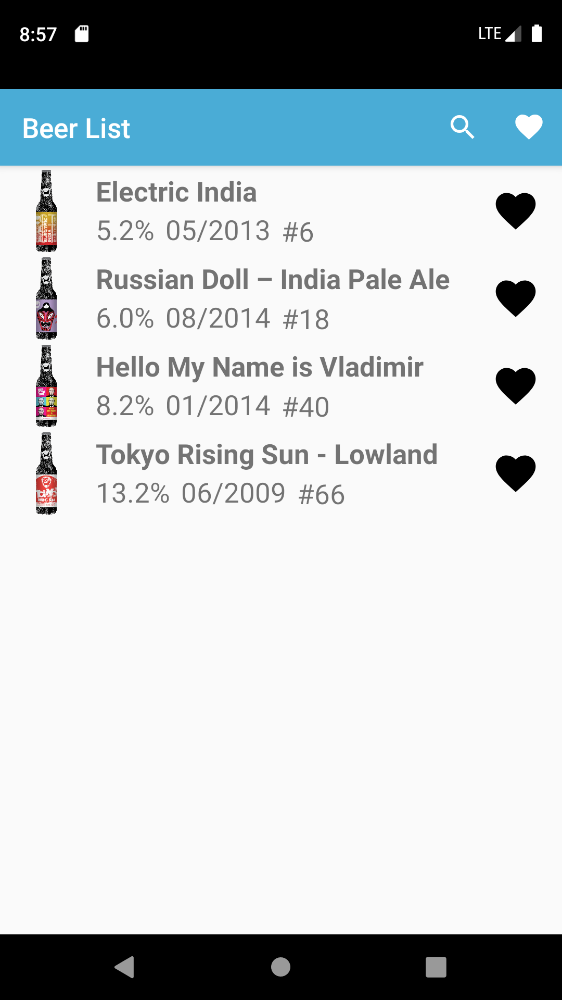

# Punk Brew



The project is an Android application developed in [Kotlin](https://github.com/JetBrains/kotlin), which represents BrewDog beer catalogue via [Punk API](https://punkapi.com). In this app you can view the entire catalog of BrewDog kinds of beer (data stored locally after first loading), view detailed information about each kind of beer, as well as add it to favorites.

## Usage

Home Activity                       | Beer Details                       | Favourite Beers                        
:----------------------------------:|:----------------------------------:|:--------------------------------------:
 |  |   

## Dependencies

* [Kotlin](https://github.com/JetBrains/kotlin) 1.3.31
* [Retrofit](https://square.github.io/retrofit/) 2.5.0
* [Room Persistence Library](https://developer.android.com/topic/libraries/architecture/room) 1.1.1
* [kotlinx.coroutines](https://github.com/Kotlin/kotlinx.coroutines) 1.3.0-M1
* [Picasso](https://github.com/square/picasso) 2.71828

## Building

Run [Gradle](https://github.com/gradle/gradle) from the root directory of the project to build it.

``` bash
./gradlew build
```

After completion there will be two directories in app/build/outputs/apk with apk files for debug and release.

## License

[MIT](LICENSE) © [alxiw](https://github.com/alxiw)
