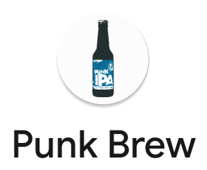
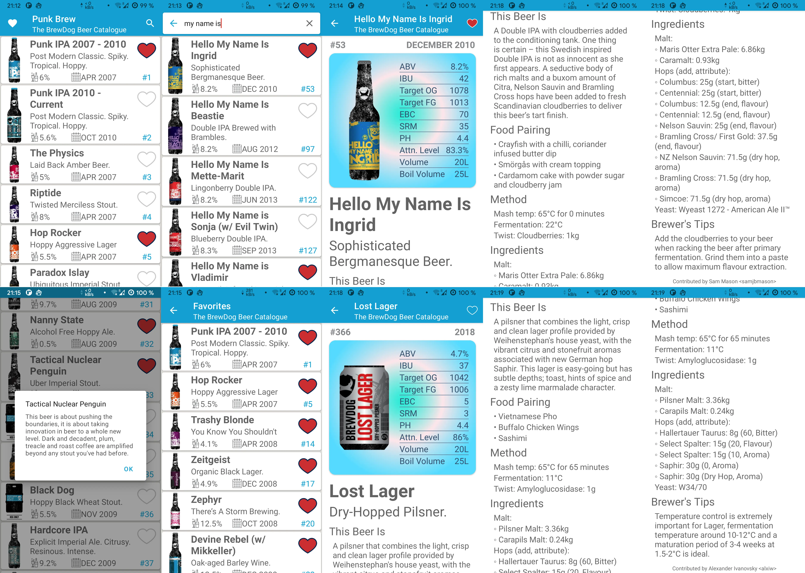

# Punk Brew

An Android application built around the [PunkAPI](https://github.com/alxiw/punkapi) — a mobile catalog of BrewDog beers.

## Features

- **Catalog** — browse the full BrewDog beer lineup
- **Search** — find beers by name or number using the search bar at the top
- **Quick preview** — long-tap any item to peek at a brief description in a dialog view
- **Beer details** — tap a beer to explore its full profile: brewing parameters, detailed recipe, and food pairings
- **Favorites** — mark beers as favorites and access them on a dedicated screen

## Architecture

The app follows a Layered Architecture with a clear separation into data, domain, and presentation layers. The presentation layer is based on MVVM. Data is fetched with pagination via Paging 2, cached locally via Room and served as the single source of truth, enabling offline access to previously loaded content. The UI is built with edge-to-edge support.

## Screenshots

## Tech Stack

* [Kotlin](https://github.com/JetBrains/kotlin) 2.4.0
* [Koin](https://github.com/InsertKoinIO/koin) 4.2.1
* [Coroutines](https://github.com/Kotlin/kotlinx.coroutines) 1.11.0
* [Retrofit](https://github.com/square/retrofit) 3.0.0
* [Room](https://developer.android.com/topic/libraries/architecture/room) 2.8.4
* [Paging](https://developer.android.com/topic/libraries/architecture/paging) 2.1.2
* [Picasso](https://github.com/square/picasso) 2.71828
* [Groupie](https://github.com/lisawray/groupie) 2.10.1
* [ThreeTen Backport](https://www.threeten.org/threetenbp/) 1.7.3

## License

[MIT](LICENSE) © [alxiw](https://github.com/alxiw)
