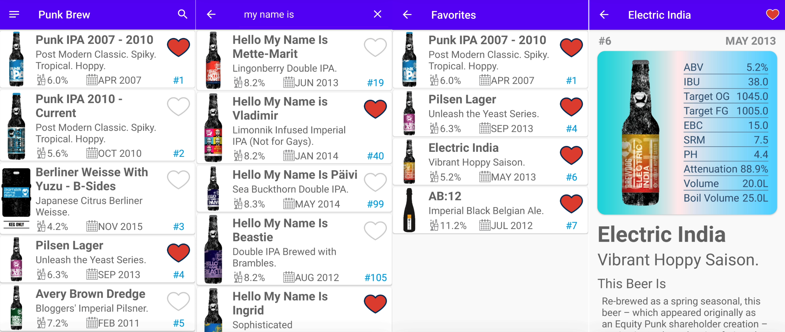

# Punk Brew

Android application which represents [BrewDog](https://www.brewdog.com) beer catalogue receiving data via Punk API and store data locally. In this application you can view the entire catalog of BrewDog kinds of beer, detailed information about each kind and add some items to favorites.

## Usage

## Dependencies

* [Kotlin](https://github.com/JetBrains/kotlin) 2.4.0
* [Koin](https://github.com/InsertKoinIO/koin) 4.2.1
* [Coroutines](https://github.com/Kotlin/kotlinx.coroutines) 2.2.21
* [Retrofit](https://github.com/square/retrofit) 3.0.0
* [Room](https://developer.android.com/topic/libraries/architecture/room) 2.8.4
* [Paging](https://developer.android.com/topic/libraries/architecture/paging) 2.1.2
* [Picasso](https://github.com/square/picasso) 2.71828
* [Groupie](https://github.com/lisawray/groupie) 2.10.1
* [ThreeTen Backport](https://www.threeten.org/threetenbp/) 1.7.3

## License

[MIT](LICENSE) © [alxiw](https://github.com/alxiw)
